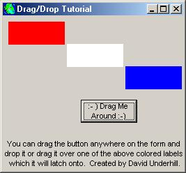



## A Drap and Drop Tutorial

### Description

Explains dragging and dropping of controls. It shows how to accurately find drop spots and is fully commented and very concise. If you have any trouble whatsoever, feel free to email me and I'll respond as quickly as possible. Enjoy this drag and drop tutorial.
 
### More Info
 

             |
---                |---
**Submitted On**   |2002-03-26 14:08:54
**By**             |[Dound](https://github.com/Planet-Source-Code/PSCIndex/blob/master/ByAuthor/dound.md)
**Level**          |Beginner
**User Rating**    |4.8 (82 globes from 17 users)
**Compatibility**  |VB 5\.0, VB 6\.0
**Category**       |[Miscellaneous](https://github.com/Planet-Source-Code/PSCIndex/blob/master/ByCategory/miscellaneous__1-1.md)
**World**          |[Visual Basic](https://github.com/Planet-Source-Code/PSCIndex/blob/master/ByWorld/visual-basic.md)
**Archive File**   |[A\_Drap\_and655843262002\.zip](https://github.com/Planet-Source-Code/dound-a-drap-and-drop-tutorial__1-33088/archive/master.zip)

